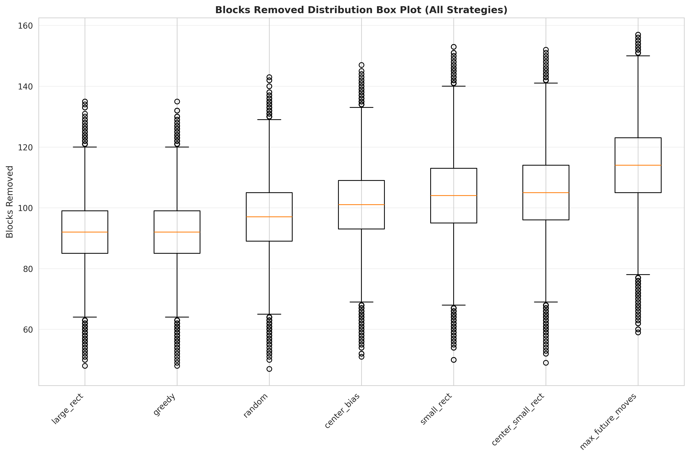
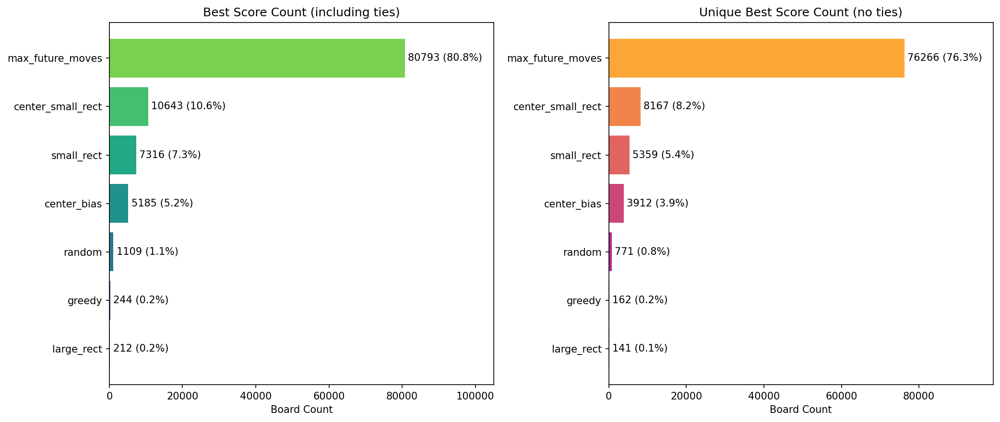
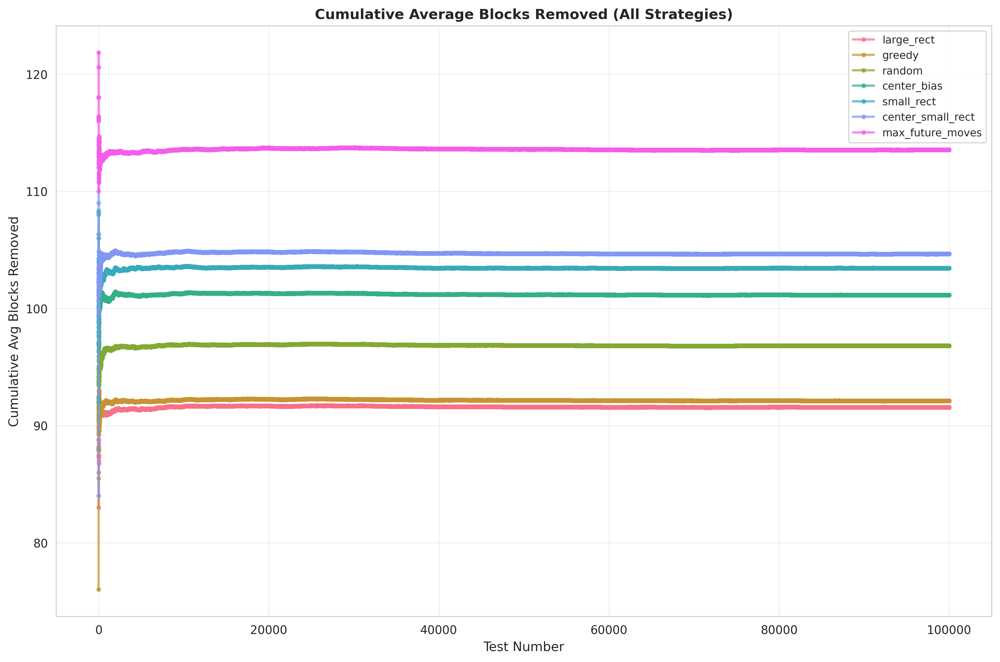

# RS10Env

**[English](README.md)** | [简体中文](README.zh-CN.md)

Gymnasium-compatible RS10 board game environment and heuristic strategies (PyTorch).

## Install

By default the project uses **CPU-only PyTorch** (smaller install; no GPU/CUDA needed if you are not training):

```bash
# With uv (recommended; installs torch from PyTorch CPU index)
uv add rs10env

# Or from source: clone repo, then sync in project root
git clone https://github.com/xx025/rs10env.git
cd rs10env
uv sync
```

For **GPU/CUDA**, install the matching torch first, then rs10env, e.g.  
`uv pip install torch --index-url https://download.pytorch.org/whl/cu124`, then `uv sync`.

## Environment

RS10Env is a turn-based env: each step selects a rectangle whose cells sum to a target (default 10) and clears it. Board: `H×W` (default 16×10), cells 0–9. Full spec (observation/action space, mask, reward): **[API reference](docs/API.md)**.

## API usage

See **[docs/API.md](docs/API.md)** for environment API and code examples (single board, multi-game comparison, low-level env + strategy).

## Streamlit app

Two modes: **single board (multiple strategies)** and **multi-game comparison** (with progress). Best strategy is highlighted.

```bash
uv add rs10env[app]
rs10env-app
# or from repo root
uv run streamlit run app.py
```

## Strategies

- `random` — uniform over valid actions  
- `greedy` — clear as many cells as possible  
- `center_bias` — prefer rectangles closer to board center  
- `large_rect` / `small_rect` — prefer larger / smaller area  
- `center_small_rect` — center + small area  
- `epsilon_greedy` — ε-greedy  
- `max_future_moves` — choose action that maximizes valid moves on the next state  

## Benchmark (strategy comparison)

Batch runs on a fixed set of boards (16×10, target_sum=10). Below: 100k games per strategy. “Best count” / “Share” = times that strategy cleared the most cells in a game.

| Strategy | Tests | Avg steps | Avg removed | Time/game (s) | Best count | Share (%) |
|----------|-------|-----------|--------------|---------------|-----------|-----------|
| random | 100,000 | 40.72 | 96.82 | 0.32 | 1,109 | 1.11 |
| greedy | 100,000 | 36.38 | 92.11 | 0.31 | 244 | 0.24 |
| center_bias | 100,000 | 43.15 | 101.15 | 0.31 | 5,185 | 5.19 |
| large_rect | 100,000 | 36.33 | 91.57 | 0.31 | 212 | 0.21 |
| small_rect | 100,000 | 45.77 | 103.44 | 0.39 | 7,316 | 7.32 |
| center_small_rect | 100,000 | 46.31 | 104.65 | 0.52 | 10,643 | 10.64 |
| max_future_moves | 100,000 | 50.07 | 113.54 | 8.12 | 80,793 | 80.79 |

`max_future_moves` clears the most on average and wins most often, at higher per-game cost; `center_small_rect` and `small_rect` offer a good trade-off.

Cells removed by strategy (boxplot):



Best-strategy share (who clears the most in each game):



Cumulative average cells removed over games:



## Dependencies

- Python >= 3.10  
- PyTorch >= 2.0  
- Gymnasium >= 1.0  
- NumPy >= 1.24  

## Related projects

This repo focuses on **simulation environment and strategies** (Gymnasium + heuristics). Other open-source projects that implement automation or assist tools for similar number-sum-elimination mechanics (various platforms):

| Project | Platform | Description |
|---------|----------|-------------|
| [nusery (longlifedahan)](https://github.com/longlifedahan/longlifedahan.github.io/blob/master/nusery.html) | Web | HTML/JS frontend, [playable demo](https://longlifedahan.github.io/nusery.html) |
| [Opening_Nursery_For_Mac](https://github.com/guzhoudong521/Opening_Nursery_For_Mac) | macOS | Python, pyautogui + OpenCV + Tesseract |
| [nursery-bot](https://github.com/rikkayoru/nursery-bot) | Windows | Python bot, Tesseract OCR |
| [KaiJuTuoErSuo](https://github.com/hncboy/KaiJuTuoErSuo) | Android | Java + ADB, OpenCV, OCR, DFS for elimination path |
| [tuoersuo](https://gitee.com/Nidhoog/tuoersuo) | — | Automation script (Gitee) |
