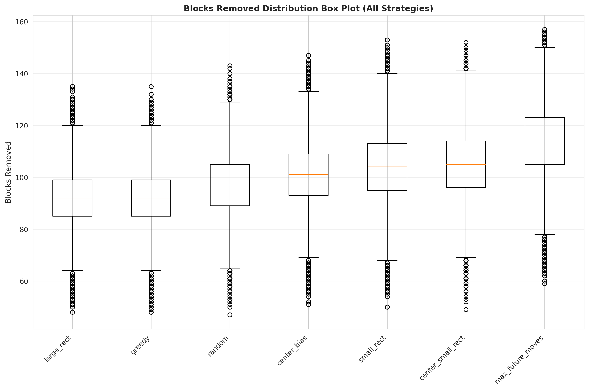
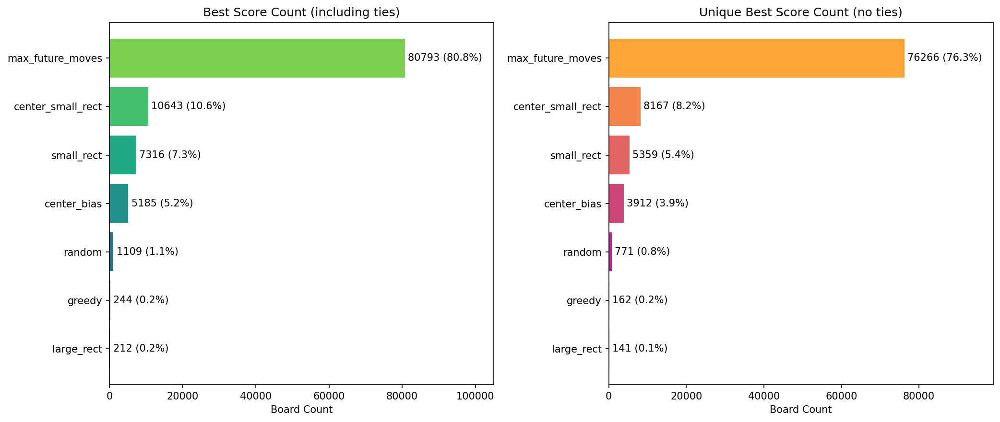
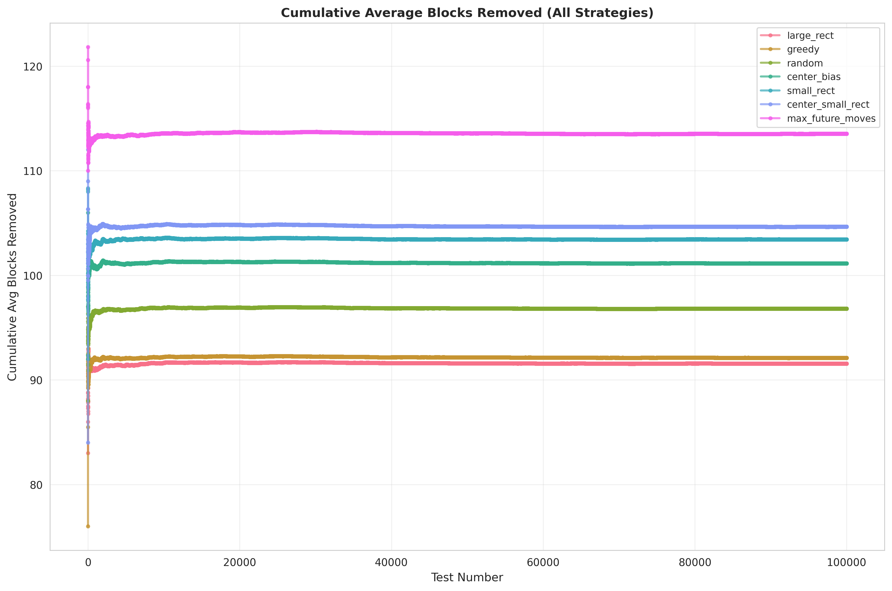

# RS10Env

[English](README.md) | **简体中文**

基于 Gymnasium 的 RS10 棋盘环境与启发式策略（PyTorch）。

**PyPI:** [rs10env](https://pypi.org/project/rs10env/) · **GitHub:** [xx025/rs10env](https://github.com/xx025/rs10env)

## 安装

默认使用 **仅 CPU 的 PyTorch**（体积更小；若不训练可不装 GPU/CUDA）：

```bash
# 使用 uv（推荐；从 PyTorch CPU 源安装 torch）
uv add rs10env

# 或从源码安装：克隆仓库后在项目根目录执行 sync
git clone https://github.com/xx025/rs10env.git
cd rs10env
uv sync
```

需要 **GPU/CUDA** 时，先安装对应版本的 torch，再安装 rs10env，例如：  
`uv pip install torch --index-url https://download.pytorch.org/whl/cu124`，然后 `uv sync`。

## 环境

RS10Env 为回合制环境：每步选择一个单元格和为目标值（默认 10）的矩形并清除。棋盘 `H×W`（默认 16×10），格值 0–9。完整说明（观测/动作空间、mask、奖励）：**[API 参考](docs/API.zh-CN.md)**。

## API 使用

环境 API 与代码示例（单棋盘多策略、多局对比、底层 env+策略）见 **[docs/API.zh-CN.md](docs/API.zh-CN.md)**。

## Streamlit 应用

两种模式：**单棋盘多策略** 与 **多局对比**（带进度）。会标出最佳策略。

```bash
uv add rs10env[app]
rs10env-app
# 或在仓库根目录
uv run streamlit run app.py
```

## 策略

- `random` — 在合法动作上均匀随机  
- `greedy` — 尽量多清格  
- `center_bias` — 偏向靠近中心的矩形  
- `large_rect` / `small_rect` — 偏向面积大 / 小  
- `center_small_rect` — 中心 + 小面积  
- `epsilon_greedy` — ε-贪心  
- `max_future_moves` — 选使下一步合法动作数最多的动作  
- `multi_start`: 默认模拟 128 条带随机性的小矩形/中心偏好路线，执行终局清除格数最多的方案。支持 `num_rollouts` 调整搜索预算；使用 NumPy 在 CPU 上批量搜索，返回环境设备上的动作。执行中若棋盘或规则变化，会重新规划。
- `trajectory_search`: 在 `multi_start` 初始解上进行行动序列优化，反复改变前缀并修复后续路线，保留终局得分不下降的方案。

### 最新策略

**最新策略：`population_search`。实现者：gpt6 astra。**

目标按默认 16×10 棋盘的平均清除格数衡量。两组独立棋盘共 60 局，平均 **129.98 格**、整局平均 **8.20 秒**、最大 **8.63 秒**，**0/60 局超过 10 秒**。这是本机预热后的实测，不是所有硬件上的硬实时保证，也不保证每局都达到 130 格。

```bash
pip install -e '.[search]'
```

```python
import torch
from rs10env import RS10Env, create_strategy, run_episode
from rs10env.fast_search import PopulationSearchStrategy

torch.set_num_threads(1)
PopulationSearchStrategy.warmup()  # 首次编译单独执行，不计入单局耗时
env = RS10Env(device="cpu")
strategy = create_strategy("population_search", time_budget=8.0, seed=68, device="cpu")
print(run_episode(env, strategy, seed=3000))
```

主要变化：使用 Numba 编译搜索；按列区间累积行和，只枚举合法矩形并为合法动作采样；维护 12 条候选路线，允许候选暂时退步以跳出局部最优，同时单独保存历史最佳完整方案。8 秒内约完成 5万至10万次路线搜索。开发与参数试验使用种子 42–46、2000–2004，以下两组种子均未参与调参。

| 独立棋盘种子 | max_future_moves | trajectory_search | population_search | 平均秒/局 | 最大秒/局 |
|--------------|-----------------:|------------------:|------------------:|----------:|----------:|
| 3000–3029 | 117.77 | 125.00 | **131.10** | 8.216 | 8.627 |
| 4000–4029 | 116.27 | 123.37 | **128.87** | 8.190 | 8.264 |
| 合计 60 局 | 117.02 | 124.18 | **129.98** | 8.203 | 8.627 |

默认规则，CPU 单线程，每局策略种子重置为 68。对 `max_future_moves` 为 60 胜，平均多清 12.97 格；对 `trajectory_search` 为 52 胜 / 2 平 / 6 负，平均多清 5.80 格。这里比较的是各自预算下的效果，不代表严格相同耗时下的优势。

时间预算 `time_budget` 只覆盖规划，每 16 次搜索检查一次，是软截止；还需加上最后一个批次、环境重置与方案执行时间。开发时首次编译约 4.11 秒，评测时已有缓存，预热约 0.25 秒，均不计入单局结果。冷启动可能超过 10 秒，其他机器和负载下也需重新测量。CPU 上完成搜索，尚未验证 CUDA 端到端延迟。

按时间停止时，不同机器完成的搜索次数不同，结果可能不同；要确定性复现算法测试，可设固定 `max_rollouts` 并给足 `time_budget`，避免触发时间截止。

```bash
python -m rs10env.benchmark --population --games 30 --seed 3000
python -m rs10env.benchmark --population --games 30 --seed 4000
```

逐局原始结果：[3000–3029](docs/benchmark/population_search_3000_3029.json)、[4000–4029](docs/benchmark/population_search_4000_4029.json)。安装 `search` 可选依赖后，界面策略列表会显示 `population_search`。

### 上一版 trajectory_search

**实现者：gpt6 astra。**

与上一版独立随机试跑不同，新策略积累并优化已有解：在不同深度截断当前最佳路线，优先尝试不同的动作，用不同强度的旧动作偏好修复剩余路线。既探索早期决策，也优化残局；同分方案可替换以探索新的路线。搜索同时排除对角端点已被删除、永远不可能再合法的矩形。

这是行动序列局部搜索与修复方法的工程实现，不声称提出全新基础算法或达到全局最优。在相同初始棋盘、种子与预算下，搜索保留 `multi_start` 初始解，不会降低该初始解的最终清除格数；这不是对任意基线或任意耗时预算的保证。

```python
from rs10env import RS10Env, create_strategy, run_episode

env = RS10Env(device="cpu")
strategy = create_strategy("trajectory_search", num_rollouts=128,
                           iterations=24, batch_size=64, seed=68, device="cpu")
print(run_episode(env, strategy, seed=2000))
```

`iterations` 控制优化轮数，`batch_size` 控制每轮替代路线数量。增加预算不保证严格提升，可能停在局部最优；搜索在 CPU 上完成，主要耗时集中于首次规划。

### 行动序列搜索评测

先在种子 42–46 上开发，再固定默认参数，在未参与开发的种子 2000–2029 上评测。CPU 单线程、16×10、目标和 10，每局策略种子重置为 68：

| 策略 | 平均清除格数 | 秒/局 |
|------|-------------:|------:|
| max_future_moves | 109.27 | 0.974 |
| multi_start（128 条） | 111.33 | 1.343 |
| multi_start（512 条） | 113.30 | 6.157 |
| trajectory_search | **118.10** | 4.542 |

- 相对原最强 `max_future_moves`：多清 8.83 格（8.08%），26 胜 / 2 平 / 2 负，配对差值近似 95% 置信区间 [6.94, 10.72] 格；耗时为其 4.66 倍。
- 相对上一版默认 `multi_start`：多清 6.77 格，30 胜 / 0 平 / 0 负。
- 相对 512 条独立试跑：多清 4.80 格，26 胜 / 1 平 / 3 负，平均耗时还少约 26%。这是实际耗时对照，不是严格限定相同墙钟预算的实验。

仅 30 局独立验证，尚不能称为全面领先，也没有最优解差距或 GPU 性能证明。不同棋盘集的绝对均分不能直接横向比较。

```bash
python -m rs10env.benchmark --games 30 --seed 2000
# 可用 --output new_results.json 写入逐局数据；不会覆盖已有文件
```

本次[逐局原始结果](docs/benchmark/trajectory_search_2000_2029.json)已保存。

### 上一版 multi_start 评测

```python
from rs10env import create_strategy, RS10Env, run_episode

env = RS10Env(device="cpu")
strategy = create_strategy("multi_start", num_rollouts=128, seed=68, device="cpu")
result = run_episode(env, strategy, seed=1000)
print(result)
```

历史评测使用以下种子和预算；当前入口已增加新策略与 512 条试跑对照，配对统计改为针对 `trajectory_search`：

```bash
python -m rs10env.benchmark --games 30 --seed 1000 --rollouts 128
```

本机 CPU 单线程、16×10、目标和 10，棋盘种子 1000–1029，每局策略种子重置为 68：

| 策略 | 平均清除格数 | 秒/局 |
|------|-------------:|------:|
| center_small_rect | 107.50 | 0.646 |
| max_future_moves（加速后） | 115.77 | 1.804 |
| multi_start | 117.33 | 1.946 |

相对 `max_future_moves`：平均多清 1.57 格（约 1.35%），18 胜 / 3 平 / 9 负，配对差值近似 95% 置信区间 [0.36, 2.77] 格。仅为 30 局初步结果，不保证所有棋盘更优，也不能直接与下方历史 10 万局数据比较。更大 `num_rollouts` 会增加时间和内存开销；尚未评估 GPU 性能。

本次同时修复指定棋盘对比被随机重置的问题，并补齐前缀和合法性检查的对角线条件。`max_future_moves` 改为直接模拟棋盘并用前缀和计算后继动作数，保留原有评分和随机决胜规则。

## 基准（策略对比）

在固定棋盘集上批量对局（16×10，target_sum=10）。每策略 10 万局。「最佳次数」/「占比」= 该策略在该局清除格数最多的局数与占比。

| 策略 | 测试局数 | 平均步数 | 平均清除格数 | 单局耗时 (s) | 最佳次数 | 占比 (%) |
|------|----------|----------|--------------|--------------|----------|----------|
| random | 100,000 | 40.72 | 96.82 | 0.32 | 1,109 | 1.11 |
| greedy | 100,000 | 36.38 | 92.11 | 0.31 | 244 | 0.24 |
| center_bias | 100,000 | 43.15 | 101.15 | 0.31 | 5,185 | 5.19 |
| large_rect | 100,000 | 36.33 | 91.57 | 0.31 | 212 | 0.21 |
| small_rect | 100,000 | 45.77 | 103.44 | 0.39 | 7,316 | 7.32 |
| center_small_rect | 100,000 | 46.31 | 104.65 | 0.52 | 10,643 | 10.64 |
| max_future_moves | 100,000 | 50.07 | 113.54 | 8.12 | 80,793 | 80.79 |

`max_future_moves` 平均清除最多、胜出局数最多，但单局耗时较高；`center_small_rect`、`small_rect` 在效果与耗时之间较均衡。

各策略清除格数分布（箱线图）：



最佳策略占比（每局清除最多者）：



累计平均清除格数随对局数变化：



## 依赖

- Python >= 3.10  
- PyTorch >= 2.0  
- Gymnasium >= 1.0  
- NumPy >= 1.24  

## 相关项目

本仓库侧重 **仿真环境与策略**（Gymnasium + 启发式）。以下为同样针对「数和消除」类玩法的其他开源实现（自动化/辅助，多平台），仅供参考：

| 项目 | 平台 | 说明 |
|------|------|------|
| [nusery (longlifedahan)](https://github.com/longlifedahan/longlifedahan.github.io/blob/master/nusery.html) | Web | HTML/JS 前端，[在线试玩](https://longlifedahan.github.io/nusery.html) |
| [Opening_Nursery_For_Mac](https://github.com/guzhoudong521/Opening_Nursery_For_Mac) | macOS | Python + pyautogui + OpenCV + Tesseract |
| [nursery-bot](https://github.com/rikkayoru/nursery-bot) | Windows | Python bot，Tesseract OCR |
| [KaiJuTuoErSuo](https://github.com/hncboy/KaiJuTuoErSuo) | 安卓 | Java + ADB，OpenCV、OCR，DFS 消除路径 |
| [tuoersuo](https://gitee.com/Nidhoog/tuoersuo) | — | 辅助脚本（Gitee） |
